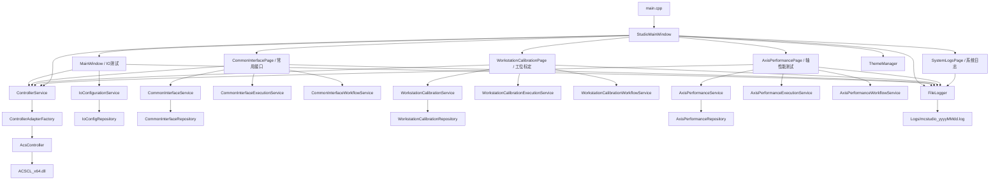

# MCStudio 软件结构图与类说明

## 1. 总体结构图



## 2. 当前推荐分层

```text
presentation
  StudioMainWindow
  MainWindow
  LoggedPageWidget
  CommonInterfacePage
  WorkstationCalibrationPage
  AxisPerformancePage
  SystemLogsPage

application/services
  ControllerService
  IoConfigurationService
  CommonInterfaceService
  CommonInterfaceExecutionService
  CommonInterfaceWorkflowService
  WorkstationCalibrationService
  WorkstationCalibrationExecutionService
  WorkstationCalibrationWorkflowService
  AxisPerformanceService
  AxisPerformanceExecutionService
  AxisPerformanceWorkflowService

domain
  interfaces/
    IControllerAdapter
  models/
    IOPoint
    CommonInterfaceCommand
    WorkstationCalibration
    AxisPerformanceTest
    AxisPerformanceResult
    ControllerTypes

infrastructure
  acs/
    AcsController
  controllers/
    ControllerAdapterFactory
  config/
    IoConfigRepository
    CommonInterfaceRepository
    WorkstationCalibrationRepository
    AxisPerformanceRepository
  logging/
    FileLogger
  theme/
    ThemeManager
```

## 3. 各层职责

### 3.1 `presentation`

职责：

- 负责页面布局、控件事件绑定、状态展示
- 不直接承担复杂业务流程
- 复杂动作尽量委托给 `ExecutionService` 或 `WorkflowService`

核心类：

- `StudioMainWindow`
- `MainWindow`
- `LoggedPageWidget`
- `CommonInterfacePage`
- `WorkstationCalibrationPage`
- `AxisPerformancePage`
- `SystemLogsPage`

### 3.2 `application/services`

职责：

- 承担页面背后的应用层逻辑
- 连接页面层与底层控制器/配置仓储
- 按职责继续细分为三种 service

三种 service 类型：

- `*Service`
  - 负责配置文件读写、基础数据提供
- `*ExecutionService`
  - 负责控制器动作执行、等待完成、采样
- `*WorkflowService`
  - 负责业务判断、状态流转、数据组装、结果计算

### 3.3 `domain`

职责：

- 保存核心模型和接口
- 不依赖具体 UI
- 不依赖具体控制器实现

### 3.4 `infrastructure`

职责：

- 负责与外部系统交互
- 包括控制器 SDK、配置文件、日志文件、主题文件

## 4. 主要类说明

### 4.1 `StudioMainWindow`

文件：

- [studiomainwindow.h](/c:/Users/22841/Desktop/MCStudio/src/presentation/studiomainwindow.h)
- [studiomainwindow.cpp](/c:/Users/22841/Desktop/MCStudio/src/presentation/studiomainwindow.cpp)

作用：

- 软件主框架窗口
- 管理左侧导航、页面切换、主题切换、控制器连接
- 懒加载业务页面
- 记录系统级日志

### 4.2 `LoggedPageWidget`

文件：

- [loggedpagewidget.h](/c:/Users/22841/Desktop/MCStudio/src/presentation/loggedpagewidget.h)
- [loggedpagewidget.cpp](/c:/Users/22841/Desktop/MCStudio/src/presentation/loggedpagewidget.cpp)

作用：

- 页面公共基类
- 统一状态提示和日志落盘入口
- 降低各业务页重复代码

### 4.3 `MainWindow`

文件：

- [mainwindow.h](/c:/Users/22841/Desktop/MCStudio/src/presentation/mainwindow.h)
- [mainwindow.cpp](/c:/Users/22841/Desktop/MCStudio/src/presentation/mainwindow.cpp)

作用：

- `IO` 测试页面
- 显示和轮询数字量/模拟量点位
- 执行点位写入
- 管理 IO 配置编辑

### 4.4 `CommonInterfacePage`

文件：

- [commoninterfacepage.h](/c:/Users/22841/Desktop/MCStudio/src/presentation/commoninterfacepage.h)
- [commoninterfacepage.cpp](/c:/Users/22841/Desktop/MCStudio/src/presentation/commoninterfacepage.cpp)

作用：

- 展示常用接口按钮
- 展示物料传递拓扑图
- 响应站点点击、机械臂点击、配置编辑

当前重构状态：

- 页面层保留 UI 构建和交互协调
- 执行动作已抽到 `CommonInterfaceExecutionService`
- 物料状态判断和流转已抽到 `CommonInterfaceWorkflowService`

### 4.5 `WorkstationCalibrationPage`

文件：

- [workstationcalibrationpage.h](/c:/Users/22841/Desktop/MCStudio/src/presentation/workstationcalibrationpage.h)
- [workstationcalibrationpage.cpp](/c:/Users/22841/Desktop/MCStudio/src/presentation/workstationcalibrationpage.cpp)

作用：

- 工位标定页面
- 包括起始位、点动、步进动作、模块动作、位置保存

当前重构状态：

- 低层执行已抽到 `WorkstationCalibrationExecutionService`
- 工位/轴查找、步位保存、速度选择等已抽到 `WorkstationCalibrationWorkflowService`
- 页面层已明显瘦身

### 4.6 `AxisPerformancePage`

文件：

- [axisperformancepage.h](/c:/Users/22841/Desktop/MCStudio/src/presentation/axisperformancepage.h)
- [axisperformancepage.cpp](/c:/Users/22841/Desktop/MCStudio/src/presentation/axisperformancepage.cpp)

作用：

- 轴性能测试页面
- 管理测试配置、执行测试、导入结果、分析指标、导出报告

当前重构状态：

- 已新增 `AxisPerformanceExecutionService`
- 已新增 `AxisPerformanceWorkflowService`
- 页面已开始把测试执行、结果解析、指标计算委托给 service
- 仍有少量旧实现保留在页面类中，属于后续可继续清理项

### 4.7 `SystemLogsPage`

文件：

- [systemlogspage.h](/c:/Users/22841/Desktop/MCStudio/src/presentation/systemlogspage.h)
- [systemlogspage.cpp](/c:/Users/22841/Desktop/MCStudio/src/presentation/systemlogspage.cpp)

作用：

- 统一查看 `Logs/` 目录下日志
- 支持刷新、分类筛选、打开目录

### 4.8 `ControllerService`

文件：

- [controllerservice.h](/c:/Users/22841/Desktop/MCStudio/src/application/services/controllerservice.h)
- [controllerservice.cpp](/c:/Users/22841/Desktop/MCStudio/src/application/services/controllerservice.cpp)

作用：

- 为页面和应用层提供统一控制器访问入口
- 封装读写变量、数组读取、矩阵读取、命令执行
- 隔离 UI 与具体控制器实现

### 4.9 `CommonInterfaceExecutionService`

文件：

- [commoninterfaceexecutionservice.h](/c:/Users/22841/Desktop/MCStudio/src/application/services/commoninterfaceexecutionservice.h)
- [commoninterfaceexecutionservice.cpp](/c:/Users/22841/Desktop/MCStudio/src/application/services/commoninterfaceexecutionservice.cpp)

作用：

- 执行常用接口命令
- 等待完成变量
- 执行物料传递相关 pickup/place 动作

### 4.10 `CommonInterfaceWorkflowService`

文件：

- [commoninterfaceworkflowservice.h](/c:/Users/22841/Desktop/MCStudio/src/application/services/commoninterfaceworkflowservice.h)
- [commoninterfaceworkflowservice.cpp](/c:/Users/22841/Desktop/MCStudio/src/application/services/commoninterfaceworkflowservice.cpp)

作用：

- 判断物料是否在机械臂/工位
- 查找来源工位
- 更新物料位置状态

### 4.11 `WorkstationCalibrationExecutionService`

文件：

- [workstationcalibrationexecutionservice.h](/c:/Users/22841/Desktop/MCStudio/src/application/services/workstationcalibrationexecutionservice.h)
- [workstationcalibrationexecutionservice.cpp](/c:/Users/22841/Desktop/MCStudio/src/application/services/workstationcalibrationexecutionservice.cpp)

作用：

- 执行运动命令
- 等待轴到位
- 等待完成变量

### 4.12 `WorkstationCalibrationWorkflowService`

文件：

- [workstationcalibrationworkflowservice.h](/c:/Users/22841/Desktop/MCStudio/src/application/services/workstationcalibrationworkflowservice.h)
- [workstationcalibrationworkflowservice.cpp](/c:/Users/22841/Desktop/MCStudio/src/application/services/workstationcalibrationworkflowservice.cpp)

作用：

- 查工位、查模块、查轴
- 读取和回写轴默认速度/步长
- 收集步位保存数据
- 管理标定流程相关业务判断

### 4.13 `AxisPerformanceExecutionService`

文件：

- [axisperformanceexecutionservice.h](/c:/Users/22841/Desktop/MCStudio/src/application/services/axisperformanceexecutionservice.h)
- [axisperformanceexecutionservice.cpp](/c:/Users/22841/Desktop/MCStudio/src/application/services/axisperformanceexecutionservice.cpp)

作用：

- 执行 live 测试
- 写入测试前参数
- 启动 suite label
- 等待完成变量
- 读取控制器采样结果并构造成结果文档

### 4.14 `AxisPerformanceWorkflowService`

文件：

- [axisperformanceworkflowservice.h](/c:/Users/22841/Desktop/MCStudio/src/application/services/axisperformanceworkflowservice.h)
- [axisperformanceworkflowservice.cpp](/c:/Users/22841/Desktop/MCStudio/src/application/services/axisperformanceworkflowservice.cpp)

作用：

- 解析导入 JSON 结果
- 计算测试指标
- 查配置轴和测试项
- 合并多次测试结果
- 提供测试脚本路径和 suite label 映射

### 4.15 `FileLogger`

文件：

- [filelogger.h](/c:/Users/22841/Desktop/MCStudio/src/infrastructure/logging/filelogger.h)
- [filelogger.cpp](/c:/Users/22841/Desktop/MCStudio/src/infrastructure/logging/filelogger.cpp)

作用：

- 统一日志落盘
- 生成按天日志文件
- 提供分类日志写入

### 4.16 `ThemeManager`

文件：

- [thememanager.h](/c:/Users/22841/Desktop/MCStudio/src/infrastructure/theme/thememanager.h)
- [thememanager.cpp](/c:/Users/22841/Desktop/MCStudio/src/infrastructure/theme/thememanager.cpp)

作用：

- 管理主题与语言配置
- 读取 `Config/app_config.json`
- 应用全局样式

## 5. 典型调用链

### 5.1 工位标定点动

```text
WorkstationCalibrationPage
  -> WorkstationCalibrationWorkflowService
  -> WorkstationCalibrationExecutionService
  -> ControllerService
  -> AcsController
```

### 5.2 常用接口物料传递

```text
CommonInterfacePage
  -> CommonInterfaceWorkflowService
  -> CommonInterfaceExecutionService
  -> ControllerService
  -> AcsController
```

### 5.3 轴性能测试执行

```text
AxisPerformancePage
  -> AxisPerformanceExecutionService
  -> ControllerService
  -> AcsController
```

### 5.4 轴性能测试结果导入

```text
AxisPerformancePage
  -> AxisPerformanceWorkflowService
  -> 结果文档
  -> 指标计算
  -> 图表/报告展示
```

## 6. 当前重构建议

优先级从高到低：

1. 继续清理 `AxisPerformancePage` 中残留的旧实现
2. 给 `CommonInterface` 的拓扑图渲染增加 view-model 层
3. 为三张业务页提炼统一的页面骨架组件
4. 逐步减少页面类直接操作配置树的场景
